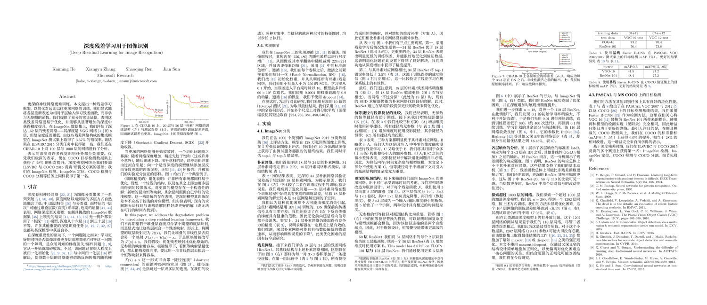

# paper-translate-zh

> 将外文学术论文 PDF 翻译为**学术化中文**，产出可直接阅读、带引用超链接的 `ZN.pdf`。
>
> An **agent Skill** that translates a foreign-language academic paper (PDF) into a polished,
> academically-styled Chinese PDF.

> [!IMPORTANT]
> **不只面向 Claude Code——适用于所有支持 Skill 规范的 CLI / 智能体工具。**
> 本仓库是一个标准 `SKILL.md` + 脚本的纯文本 Skill，与具体厂商无关。已知可用于
> [Claude Code](https://claude.com/claude-code)、[Codex](https://openai.com/codex/)、
> GitHub Copilot CLI、[Gemini CLI](https://github.com/google-gemini/gemini-cli) 等。
> 各工具只是**加载/触发方式与安装目录**不同（见下方[安装](#安装)），翻译能力本身一致。
>
> **Works with any CLI/agent tool that supports the Skills format** — not Claude-only.
> Claude Code, Codex, Copilot CLI, Gemini CLI, etc. Only the install path and trigger
> mechanism differ per tool; the translation pipeline is identical.

把一篇英文（或其他外文）论文丢给你的智能体工具，说一句「翻译一下这篇论文」，它就会：
**取得源文（arXiv 源码或 PDF）→ 写成学术化中文的 `ZN.tex` → 用 XeLaTeX 编译成 `ZN.pdf`**。
没有本地 LaTeX 环境也行——会生成 `ZN.tex` 并给出在线编译（Overleaf）步骤。



<p align="center"><sub>译文 <code>ZN.pdf</code> 实例 ——《深度残差学习用于图像识别》（ResNet，<a href="https://arxiv.org/abs/1512.03385">arXiv:1512.03385</a>，走<b>路径 A 源码直译</b>）：左—双语标题/中文摘要/可点击引用，中—公式与网络结构图原样保留，右—数据表与图注。</sub></p>

---

## 效果

| 原文 (English PDF) | 译文 (中文 ZN.pdf) |
| --- | --- |
| 中心透视、双栏、公式截图 | 单栏易读、公式 LaTeX 重排、表格重排为中文三线表 |
| `Convolutional Neural Network` | 卷积神经网络（Convolutional Neural Network, CNN） |
| `(Smith et al., 2020)` | 可点击跳转到文末的蓝色引用链接 |

译文质量是这个 Skill 的核心目标——不是逐字直译，而是**用中文学术语体重写**，
让该领域的中文学者读起来像中文写就的论文，而非「翻译腔」。

## 设计取舍

| 维度 | 处理方式 |
| --- | --- |
| **术语** | 中文为主，**首次出现括注英文全称与缩写**；`GPU`/`BERT`/`Transformer` 等约定俗成的保留原词 |
| **图片** | 提取原图嵌入对应位置，**图注译为中文**；图内坐标轴/图例等标签保留原文 |
| **表格** | 重排为 LaTeX **中文三线表**（`booktabs`），表头与表注译中文，数据照搬 |
| **公式** | 用 LaTeX **重排**（非截图），从页面渲染图逐符号转写 |
| **参考文献** | **保留原文不翻译**，但做成**可点击的超链接**（`natbib`/`thebibliography` + `hyperref`） |
| **版式** | 单栏、便于阅读；图/表/公式/章节交叉引用用 `\cref` 生成中文链接（图 1 / 式 3 / 表 2） |

## 工作流

先按**有无 LaTeX 源码**分两条路径，保真度差别很大：

```
              ┌─ 路径 A（首选）arXiv/源码 ─▶ 注入中文 + 原地翻译正文 ─┐
源文 ─判断──┤                                                       ├─▶ ZN.tex ─▶ 编译 ─▶ ZN.pdf
              └─ 路径 B  仅 PDF ─▶ 提取文字+图 ─▶ 学术化中文重排 ────┘                （无本地 LaTeX → Overleaf）
```

- **路径 A —— LaTeX 源码直译（首选）**：给出 arXiv 链接/编号时，
  `scripts/fetch_arxiv_source.sh` 下载并解包 e-print，定位主 `.tex` 与图片；只重写**正文文字**，
  公式、图、表、参考文献、交叉引用**原样保留**——保真度最高。仅注入 `xeCJK` + 中文字体即可中文化。
- **路径 B —— 从 PDF 提取**（建立在官方 [`pdf` skill](https://github.com/anthropics/skills) 之上）：
  无源码时，`scripts/extract_pdf.py`（与 `pdf` skill 同一套 pdfplumber / pypdf / poppler 工具链）
  抽出全文文字、整页渲染图与裁出的图片；公式与表格重排为 LaTeX。
- **编译**：`scripts/compile_zh.sh` 用 `latexmk -xelatex`。
  **检测到本地无 LaTeX 时不报错**，而是保留 `ZN.tex` 并打印 Overleaf 在线编译步骤（编译器选 XeLaTeX）。

## 安装

本 Skill 与厂商无关——把整个目录克隆到你所用工具的 skills 目录即可。各工具的目录约定不同：

| 工具 | skills 目录 | 克隆命令 |
| --- | --- | --- |
| **Claude Code** | `~/.claude/skills/` | `git clone https://github.com/ZhiheChen1/paper-translate-zh.git ~/.claude/skills/paper-translate-zh` |
| **Codex** | `~/.codex/skills/`（或你的 superpowers skills 路径） | `git clone https://github.com/ZhiheChen1/paper-translate-zh.git ~/.codex/skills/paper-translate-zh` |
| **Gemini CLI** | 见 Gemini CLI 的 skill/extension 目录 | 克隆到对应目录 |
| **GitHub Copilot CLI** | 见 Copilot CLI 的 skill 目录 | 克隆到对应目录 |
| **其他** | 该工具的 skills 加载目录 | 克隆到对应目录 |

> 不确定路径时，查阅对应工具关于 “skills” 的文档；只要工具能从该目录发现 `SKILL.md`，本 Skill 即可用。

安装后，在工具里直接说「**把这篇论文翻成中文**」并给出 PDF 路径即可触发（具体触发由各工具按
`SKILL.md` 的 `description` 自动判定）。

## 依赖

脚本与编译环境需要：

| 用途 | 依赖 | 安装（Debian/Ubuntu 示例） |
| --- | --- | --- |
| PDF 处理基础（提取/OCR/表单等） | 官方 [`pdf` skill](https://github.com/anthropics/skills) | Claude Code 自带；其他工具按需安装 `pdf` skill |
| PDF 文字/图片提取 | `python3` + `pdfplumber` `pypdf` `Pillow` | `pip install pdfplumber pypdf Pillow` |
| 整页渲染 | poppler（`pdftoppm` `pdfinfo`） | `apt install poppler-utils` |
| arXiv 源码下载（路径 A） | `curl` + `tar`/`gzip` | 系统自带 |
| 中文 LaTeX 编译（**可选**，无则用 Overleaf） | XeLaTeX + `ctex`/`xeCJK` + `latexmk` | `apt install texlive-xetex texlive-lang-chinese latexmk` |
| 中文字体 | Noto Serif/Sans SC、SimSun 等任一 | `apt install fonts-noto-cjk` |

`ctex` 会自动回退到系统可用的中文字体，无需手动指定。

## 手动使用脚本（不经智能体也能跑）

**路径 A（arXiv 源码）：**
```bash
# ① 下载并解包 arXiv 源码，定位主 .tex 与图片
bash scripts/fetch_arxiv_source.sh 1708.02002 path/to/work
# ② 复制主文件为 ZN.tex，注入中文支持，再原地翻译正文（翻译需人或 LLM）
#    在 \documentclass 后加： \usepackage{xeCJK}\setCJKmainfont{Noto Serif CJK SC}
#    若有 <main>.bbl，复制为 ZN.bbl
# ③ 编译
bash scripts/compile_zh.sh path/to/work/source/ZN.tex
```

**路径 B（PDF）：**
```bash
# ① 提取到工作目录
python3 scripts/extract_pdf.py path/to/paper.pdf path/to/work
# ② 以模板为基础写 work/ZN.tex（翻译需人或 LLM）
cp assets/ZN_template.tex path/to/work/ZN.tex
# ③ 编译
bash scripts/compile_zh.sh path/to/work/ZN.tex   # -> path/to/work/ZN.pdf
```

`extract_pdf.py` 可选参数：`--dpi 200`（页面渲染分辨率）、`--min-fig-px 120`（自动裁图最小尺寸，过滤 logo/公式碎块）。

> **没有本地 LaTeX？** `compile_zh.sh` 会自动检测：未装 `xelatex` 时不编译，而是保留 `ZN.tex`
> 并打印 Overleaf 上传 + 选 XeLaTeX 编译的步骤——所以**本地 LaTeX 环境是可选的**。

## 目录结构

```
paper-translate-zh/
├── SKILL.md                  # 智能体读取的工作流与翻译规则
├── assets/
│   └── ZN_template.tex       # 中文学术译文模板（ctex + 引用超链接）
├── scripts/
│   ├── fetch_arxiv_source.sh # 路径 A：下载/解包 arXiv 源码并定位主 .tex
│   ├── extract_pdf.py        # 路径 B：提取文字 + 整页渲染 + 自动裁图
│   └── compile_zh.sh         # XeLaTeX 编译 + 报错摘要（无 LaTeX 时给 Overleaf 指引）
├── README.md
└── LICENSE
```

## 已知局限

- **自动裁图只对栅格图可靠**。矢量图、被切成多块的图、组合图可能裁不准——
  这正是 Skill 强调「务必查看 `pages/` 整页渲染图」的原因：从整页图里按需手动重裁即可。
- **不做双栏还原**。译文统一为单栏，优先可读性而非版式复刻。
- **适用于学术论文**，不适合合同、幻灯片、网页等非学术文档，也不用于生成中英对照逐段阅读稿。

## License

[MIT](LICENSE)
